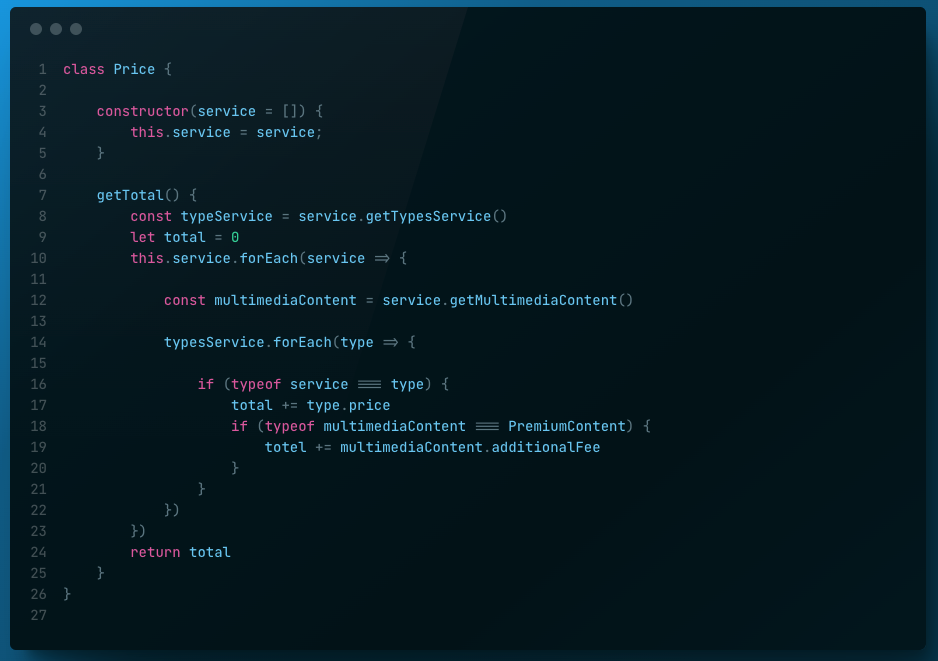

# AXPE
Prueba tecnica:

## Ejercicio 1

1. Que problemas detectas en la operación y razona la respuesta?

El principal problema que veo en la función getTotal() es que no es un código escalable. Ya que si se quieren añadir nuevos tipos de servicio, habrá que modificar el código con otro if else o los que sean necesarios y escribir la nueva variante de tipología de contenido para poder sumarle su precio particular.

2. Propón una solución alternativa (también en pseudocódigo del mismo estilo) que corrija los problemas de la
operación getTotal de RegisteredUser que has detectado en la pregunta anterior. Realiza todos los cambios que consideres necesarios en cualquiera de las clases del modelo del enunciado.

Mi propuesta es, que en cada una de las clases de tipología del servicio (ej: StreamingService) añadir un price para cada tipo. Y eliminar cualquier precio en la clase MultimediaContent. De esta manera el precio va asociado a la tipología y no al servicio. Ya que pueden ser de como mínimo 2 tipologías por el momento (StreamingService y DownloadService) y en un futuro muchas más. Como muestro en el código(pseudocódigo), haciendo así el código mucho mas escalable y mantenible:

## Ejercicio 2

1. Utilizando React y la API JavaScript de Google Maps, implementa
una solución responsive, sencilla pero eficaz para los siguientes diseños.

<small>Nota: necesitarás una API KEY de Google, puedes crearte una fácilmente
siguiendo la documentación.</small>

Este proyecto contiene variables de entorno para la API_KEY de Google, antes de ejecutar ningún comando añadir la API_KEY de google en el archivo .env tal y como indica el archivo .env.example

He creado el proyecto react con la libreria Vite.
Para poder ejecutar el proyecto hay que (en la raiz del proyecto):
- Instalar todas las dependencias:

### npm install

- Para hacer correr la aplicacion:

### npm run dev

He trabajado con Cypress para hacer test e2e. Para poder ejecutar los test usar el siguiente comando en la raíz del proyecto:

### npm run cypress:open

## Tecnologias utilizadas

- Javascript
- React
- Redux
- Sass
- Cypress
